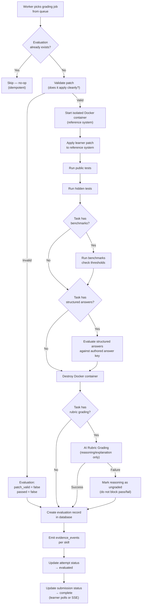

# Evaluation Flow Diagram



---

## Evaluation Decision Rule

```
passed = (patch_valid == true)
       AND (hidden_tests_passed == hidden_tests_total)
       AND (benchmarks_passed OR benchmarks_passed == null)
       AND (structured_answers_all_correct OR no_structured_answers)
```

**AI rubric results do NOT block the `passed` decision for MVP.**
They are additional evidence stored alongside the evaluation.
