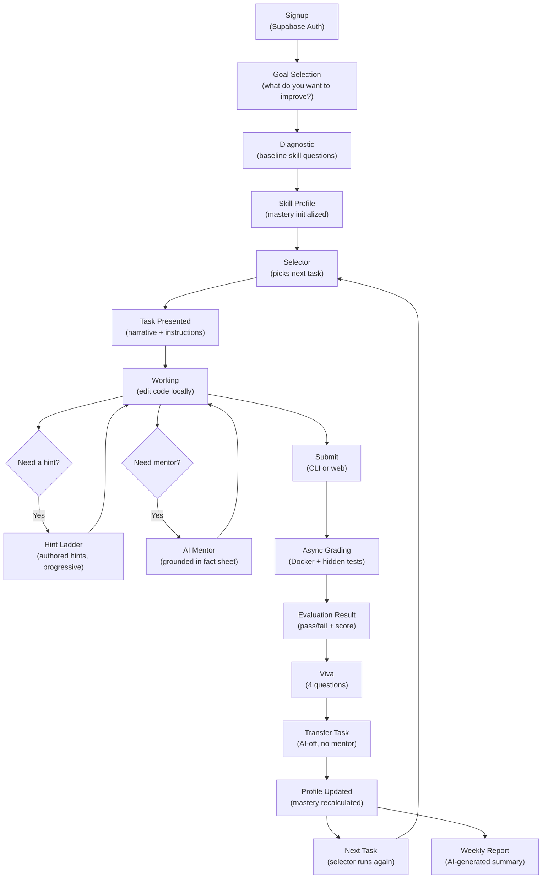

# Learner Flow Diagram

---

## Important Notes

- **Selector** runs every time a new task is needed — it does not store a pre-planned curriculum.
- **Mentor** is grounded in the variant's fact sheet. It cannot reveal hidden test details.
- **Transfer task** has no AI mentor available. This tests genuine understanding.
- **Profile update** happens after evidence events are emitted by the evaluator.
- **Weekly report** is generated on a schedule (end of week), not after every task.
