# Selector Flow Diagram

```mermaid
flowchart TD
    Start["POST /v1/sessions/:id/next\nLearner requests next task"]
    ReadState["Read Learner State\nskill_states, misconceptions, recent attempts"]
    ReadSkills["Read Skill Graph\nall active skills + edges"]
    FilterPrereqs["Filter: Remove skills whose\nprerequisites are not satisfied"]
    Priority["Rank by Priority\nlow mastery + high goal relevance"]
    Misconceptions["Check Misconceptions\nbias toward misconception-targeting tasks"]
    SelectSkill["Select Target Skill"]
    SelectMode["Select Task Mode\ndebug | build | fix | investigate"]
    SelectDifficulty["Select Difficulty\ntarget ~70% predicted success rate"]
    FindVariants["Find Suitable Variants\npublished, not recently seen, correct difficulty"]
    HasVariants{Variants\navailable?}
    Fallback["Fallback:\nSelect any available variant\nAlert content team"]
    SelectVariant["Select Variant\n(weighted random from suitable pool)"]
    Decision["Create SelectorDecision\n{ variantId, skillId, mode, difficulty, reason }"]
    CreateAttempt["Create Attempt Record\nstatus: created"]
    Return["Return task payload + attemptId\nto API → Learner"]

    Start --> ReadState
    ReadState --> ReadSkills
    ReadSkills --> FilterPrereqs
    FilterPrereqs --> Priority
    Priority --> Misconceptions
    Misconceptions --> SelectSkill
    SelectSkill --> SelectMode
    SelectMode --> SelectDifficulty
    SelectDifficulty --> FindVariants
    FindVariants --> HasVariants
    HasVariants -- No --> Fallback
    HasVariants -- Yes --> SelectVariant
    Fallback --> SelectVariant
    SelectVariant --> Decision
    Decision --> CreateAttempt
    CreateAttempt --> Return
```



---

## SelectorDecision Contract

```typescript
{
  variantId: string;
  skillId: string;
  taskMode: 'debug' | 'build' | 'fix' | 'investigate';
  difficulty: number;           // 1-5
  predictedSuccessRate: number; // 0.0-1.0, target ~0.70
  reason: string;               // human-readable explanation
  fallback: boolean;            // true if no ideal variant found
  timestamp: string;
}
```

The `SelectorDecision` is stored in the `attempts.selector_decision` JSON column for every attempt.

---

## What the Selector Does NOT Do

- Does NOT generate a new task
- Does NOT modify content (read-only access to content)
- Does NOT store a "learning path" (derived fresh each time)
- Does NOT use ML (Phase 4)
- Does NOT expose internal scoring to the learner (Phase 4 for "why this task?")

---

## Fallback Behavior

If no suitable variant is found:
1. Log a warning with the learner ID, skill, and mode
2. Relax constraints (broaden difficulty range, allow recently seen variants)
3. If still no match, return any published variant for the skill
4. Alert the content team (via ops dashboard — Phase 3)
