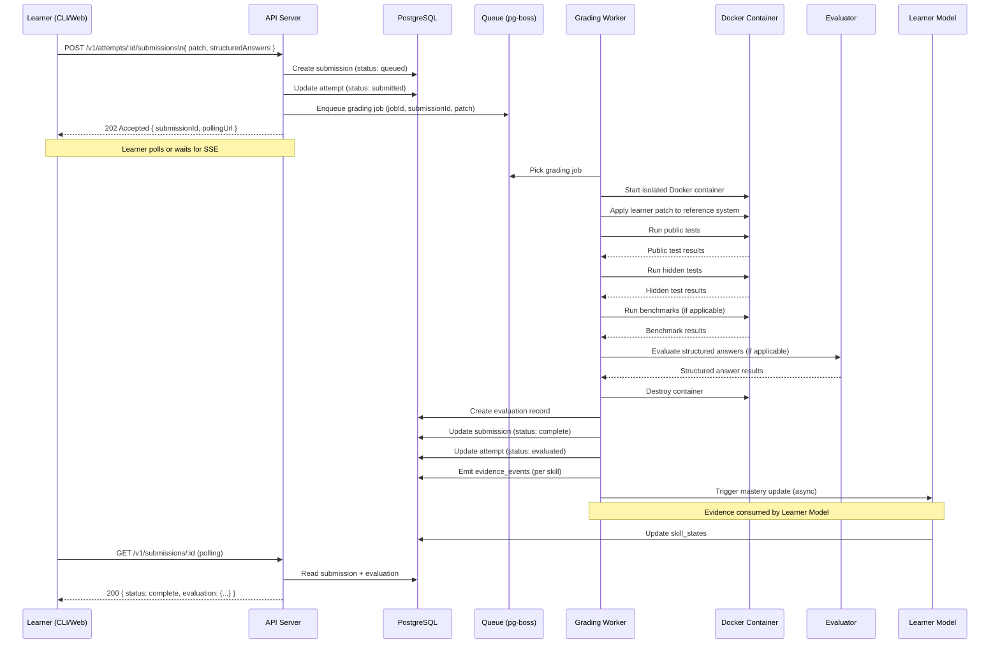

# Submission Flow Diagram

---

## Failure Paths

| Failure                 | Worker Behavior              | Learner Sees                     |
| ----------------------- | ---------------------------- | -------------------------------- |
| Docker startup fails    | Retry up to 3x with backoff  | "Grading in progress"            |
| Test runner crashes     | Mark as `grading_error`      | Error message + flag option      |
| Timeout exceeded        | Mark as `timeout`            | "Timed out" + retry option       |
| All retries exhausted   | Mark as `failed`, alert ops  | Error message + support link     |
| AI rubric grading fails | Mark reasoning as `ungraded` | Deterministic result still shown |

---

## Idempotency

- Worker checks for existing evaluation before processing a job.
- Duplicate grading job (same submission) is a no-op if evaluation already exists.
- Grading jobs have an idempotency key: `submission_id`.
