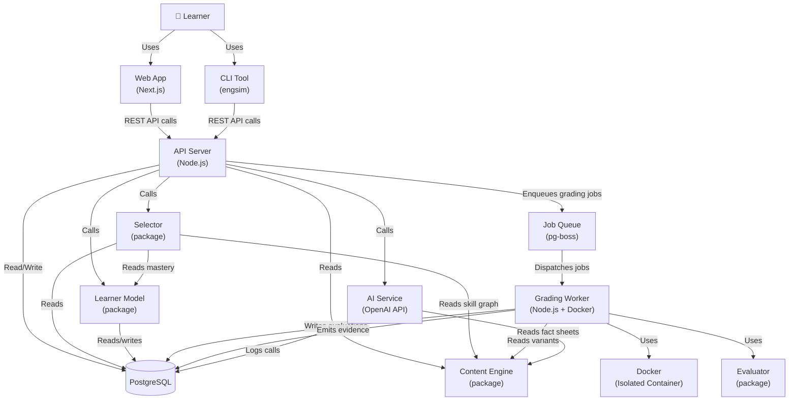

# System Context Diagram

---

## Key Boundaries

| Boundary        | Description                                                                      |
| --------------- | -------------------------------------------------------------------------------- |
| Learner ↔ API   | All learner actions go through the API. No direct DB access.                     |
| API ↔ Worker    | Async via queue. API returns 202; worker processes independently.                |
| Worker ↔ Docker | Each grading job runs in an isolated container. No shared state.                 |
| Packages ↔ DB   | Packages (selector, learner-model) access DB via `packages/database` layer only. |
| API ↔ AI        | AI calls are logged. AI never writes directly to core tables.                    |

---

## What Is NOT In This Diagram (Future)

- Redis (Phase 2+)
- Hosted sandbox fleet (Phase 5)
- Multi-region CDN (Phase 6)
- Kubernetes orchestration (Phase 5)
- Professor dashboard (Phase 3)
